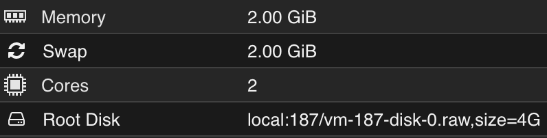

# Tverrfaglig Prosjekt - Jarl Mathias

### Om prosjektet

<b>IP: 172.20.128.64</b>

Hovedinnholdet i prosjektet er et spill inspirert av 'Wordle', men det er en tvist. Wordle er et spill hvor man prøver å gjette et ord, og så får man tilbakemelding på om bokstavene var riktig, feil plassert, feil ol. I mitt program så skal man heller gjette en 'boss' fra spillet Elden Ring. Dette prosjektet er noe jeg startet på i YFF tidligere i år, og ville bygge ut på nå. *NB! Programmet inneholder ikke hver eneste boss fra spillet, siden det finnes over 200 bosser, og dette er bare en tidskrevende prossess å legge til*

Programmet blir hovedsakelig kodet it HTML/CSS/JavaScript, men bruker en MySQL database og PHP for å snakke med databasen. Jeg har satt opp en server for MySQL databasen, og en Ubuntu server hvor programmet ligger.

### Hva gjør filene
``index.html`` → Standard HTML side. Det er her selve spillet ligger og er startsiden til programmet.

``manual.html`` → HTML side hvor brukeren kan lese seg opp på hvordan programmet fungerer.

``insertBosser.html`` → HTML side hvor det er mulig å legge til nye 'bosser' i databasen (Dette vil endre databasen for alle brukere. Dette kan kreve login senere).

``base.css`` → All CSS/styling for programmet, gjelder for alle HTML sider.

``main.js`` → All JavaScript for programmet, gjelder for alle HTML sider. Det er her mesteparten av backend-koden skjer, med unntak av det som omhandler MySQL databasen.

``getData.php`` → PHP for å hente all informasjon fra MySQL databasen, og gjør det om til riktig format for JavaScript.

``insertBosser.php`` → PHP for å sette inn en ny verdi i databasen.

``Bilder`` → Mappe som inneholder alle bilder som blir brukt i programmet.

### Spesifikasjoner

Hvilke spesifikasjoner du burde ha på serveren din for å kjøre programmet.

* En server som har Apache2 installert
* En server som har MariaDB eller MySQL installert
* Last ned PHP på Apache serveren
* Hvis du vil kan du laste ned git
* Husk å endre permissions og starting directory etter hvordan du vil ha det
  * Du kan endre DocumentRoot i /etc/apache2/sites-available/000-default.conf for å endre startside
* Sett opp en database og table på SQL serveren
* Endre PHP filene med brukernavn, passord, adresse, databasenavn og tablenavn etter hva du har satt det til

  
## Brukertesting

### Spørsmål
1. Hva skjer hvis du trykker på et av ikonene øverst?
2. Klarer du å finne deg fram til brukermanualen?
3. Skjønner du hvordan spillet fungerer ut fra manualen?
4. Klarer du å spille en runde?
5. Hva skjer når du legger til en ny 'boss'? Dukker den opp i listen?
  
6. Var programmet intuitivt å bruke?
7. Ga manualen god nok instruks og hjelp?
8. Hva synes du om utseende/grafikken?
9. Er det noe som kunne forbedres?

### Bruker 1 - Gutt 17 år

<b>IT erfaring: </b> Er erfaren når det kommer til bruk av elektronikk.

<b>Bakgrunn om spillet: </b> Bruker har ikke spilt Elden Ring før.

1. Programmet byttter side til "Manual" eller "Insert Boss".
2. Ja, trykker på dokument ikonet øverst.
3. Jeg tror jeg skjønner hvordan man spiller.
4. Jeg klarte å bruke spillet, men jeg har ikke spilt Elden Ring så jeg vant ikke.
5. Det var enkelt å legge til en ny boss som ble vist i listen.
  
6. Selve programmet var ganske intuitivt, men kanskje ikke å bytte mellom sidene.
7. Angående selve spillet ga den god nok instruks, men det sto ikke noe om hvordan man la til nye bosser.
8. Utseende var litt over alt, hver side hadde forskjellig stil, med unntak av bakgrunnen.
9. Som sagt så kunne designet og stylingen vært forbedret litt, og det kunne stått noe om å legge til bosser i manualen.

### Bruker 2 - Gutt 17 år

<b>IT erfaring: </b> Relativt komfortabel når det kommer til spill ol.

<b>Bakgrunn om spillet: </b> Bruker har spilt Elden Ring før.

1. Trykke på et av ikonene fører deg til de tilsvarende sidene i spillet.
2. Ja, jeg fant brukermanualen under "Manual" - fanen.
3. Manualen forklarer spillet ganske godt, selv om jeg måtte lese gjennom den en gang til for å forstå det fullstendig.
4. Ja, jeg spilte en runde og fant det ganske underholdende.
5. Ja, jeg la til en ny 'boss' som dukket opp i listen.
  
7. Programmet var relativt intuitivt å bruke, men det var litt tungvint å navigere mellom sidene.
8. Manualen ga en god oversikt over spillets mekanismer, men det var enkelte deler som kunne vært mer detaljerte.
9. Grafikken var delvis passende, men den varierte mellom ulike stiler.
10. Noen deler av grensesnittet kunne vært mer sammenhengende, og manualen kan forbedres.

### Bruker 3 - Mann 51 år

<b>IT erfaring: </b> Over gjennomsnittlig god for sin aldersgruppe.

<b>Bakgrunn om spillet: </b> Bruker har ikke spilt Elden Ring før.

1. Når du trykker på et av ikonene, tar det deg til de forskjellige delene av spillet, som Manual eller Insert Boss.
2. Jeg fant brukermanualen.
3. Manualen ga en god forståelse av hvordan spillet fungerer.
4. Jeg prøvde spillet, men skjønte ikke så mye.
5. Etter å ha lagt til en ny 'boss', dukket den umiddelbart opp i listen.
  
7. Det var litt vanskelig å finne seg fram uten at oppgaven sa hvordan.
8. Manualen var ganske informativ, men manglet noen punkter som å legge til bosser.
9. Grafikken var enkel og passende for et tekstbasert spill.
10. Jeg synes programmet generelt var godt laget, men det kunne ha noen forbedringer i grensesnittet og ytterligere forklaringer i manualen.

<b>*Noen endringer ble implentert her - Se implementeringsseksjon</b>

### Bruker 4 - Kvinne 48 år

<b>IT erfaring: </b> Gjennomsnittlig flink når det kommer til elektronikk, men har lite erfaring med spill.

<b>Bakgrunn om spillet: </b> Bruker har ikke spilt Elden Ring før.

1. Ved å trykke på et av ikonene øverst, blir du omdirigert til forskjellige deler av programmet.
2. Fant brukermanualen enkelt ved å klikke på dokumentikonet.
3. Manualen ga en klar forklaring på hvordan spillet fungerer, og det var lett å forstå.
4. Jeg klarte å spille en runde uten problemer. *NB! Bruker vant ikke siden hun ikke hadde spilt Elden Ring*
5. Etter å ha lagt til en ny 'boss', dukket den opp i listen som forventet.
6. Programmet var relativt intuitivt å bruke, men det tok litt tid å venne seg til navigasjonen mellom sidene.
  
8. Jeg fant manualen ganske informativ.
9. Grafikken passet ikke alle steder.
10. Det var noen områder som kunne forbedres, for eksempel utseende. Generelt sett var det en positiv opplevelse å bruke programmet.

## Implementeringsseksjon
<b>*Implementert før Bruker 4 brukertestet</b>
* Lagde en mer utfyllende brukermanual, som bl.a. inneholder å legge til bosser og hvordan man navigerer.
* Gjorde design/stilen mer gjengående mellom sidene (dette kan fortsatt forbedres mer).

## Sikkerhet
* Programmet er mest sannsynlig sårbar mot 'SQL Injection'
* 

## Kilder
PHP, CSS og MySQL - https://www.w3schools.com/

GitHub in Ubuntu - https://www.howtoforge.com/tutorial/install-git-and-github-on-ubuntu/

Fextralife Elden Ring Wiki - https://eldenring.wiki.fextralife.com/Elden+Ring+Wiki

Fandom Elden Ring WIki - https://eldenring.fandom.com/wiki/Elden_Ring_Wiki
